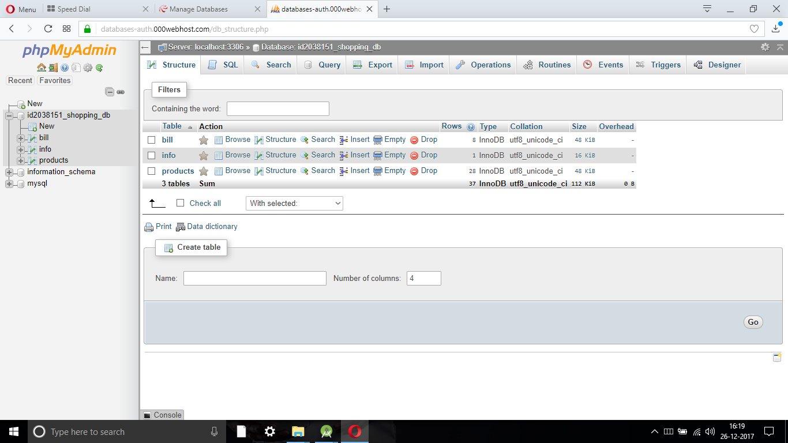
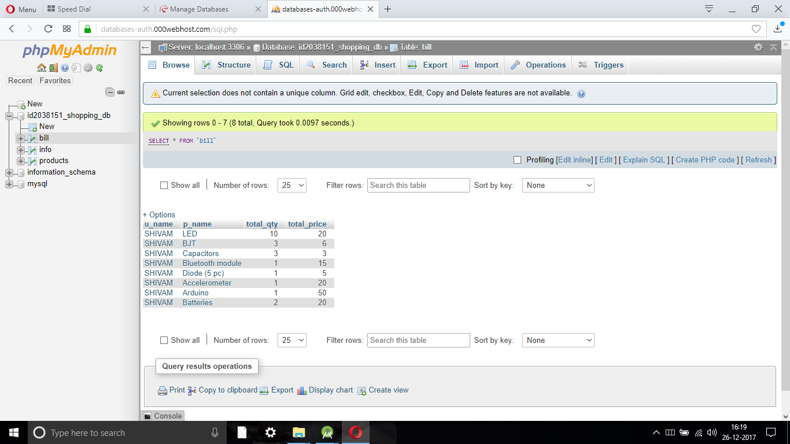
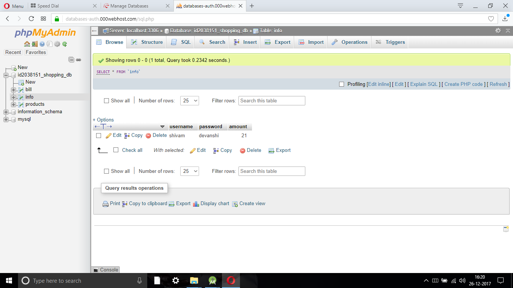
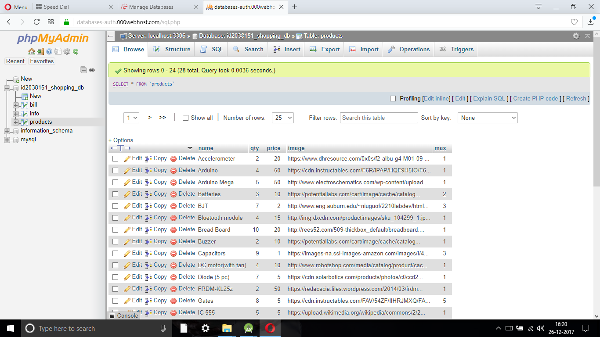

# Maker's Challenge Files
<b>For any Product both Frontend and Backend are important.</b>
 
<b>The Core part of this Project lies here in Backend as it Manages the Transactions.</b>

<h1>Concurrency Control</h1>
Concurrency control protocols can be broadly divided into two categories −
 
1. Lock based protocols
 
2. Time stamp based protocols
<h4>I have used Binary Lock based Protocol here.</h4>
<b>What I have done is :</b>  
<ul>
  <li>Locked my Database(MYSQL) when a Participant is trying to buy a Component.</li>
  <li>After, the status is sent to the Participant,the Database Unlocks.</li>
</ul>

<h1>MYSQL Database Structure</h1>
<h4>Tables info</h4>

<h4>Bill Table</h4>

<h4>Participant Info Table</h4>

<h4>Products Table</h4>

